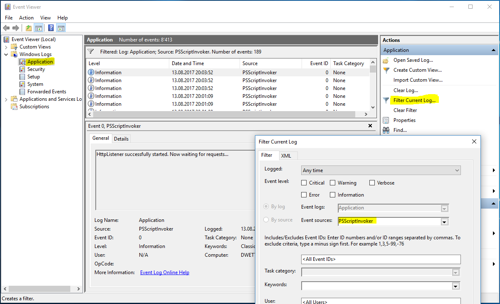
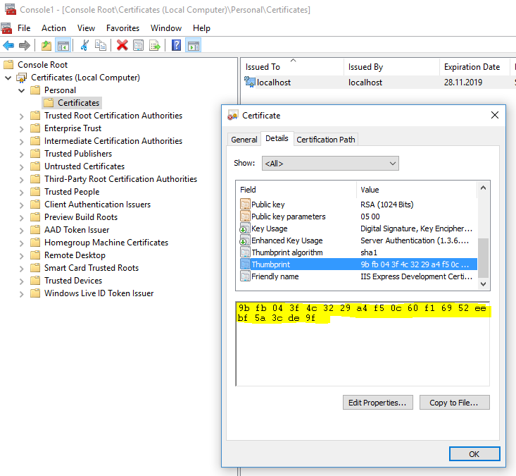

# Description

This project installs a service containing a [HttpListener](https://msdn.microsoft.com/en-us/library/system.net.httplistener.aspx) and/or a [RabbitMQ](https://www.rabbitmq.com/) consumer. It can be used to invoke Powershell scripts synchronously over HTTP(S) requests or asynchronously over RabbitMQ messages.


# Installation

For installing the service just download, extract and execute the installer from here: [Releases](https://github.com/dwettstein/PSScriptInvoker/releases)

For installing the service with Visual Studio, have a look at the [section Advanced Installation](#advanced-installation)

After the installation you need to configure the service according to your need and then start it within _Windows Services_ (see [section Logging](#logging) below for tracking the starting progress).


# Configuration

The following variables can be set in the service configuration file `PSScriptInvoker.exe.config` within the service installation folder (default `C:\Program Files\PSScriptInvoker\`):

Key                        | Example                           | Description
---------------------------|-----------------------------------|-------------
baseUrl                    | http://127.0.0.1:8888/            | Protocol, IP/hostname and port you want to use for the service (default `http://127.0.0.1:8888/`). For using HTTPS see [section HTTPS](#https) at the end of this documentation.
authToken                  | meowmeowmeow                      | The token used for the authentication. If empty, no _Authorization Header_ is sent.
pathToScripts              | C:\root\path\of\psscripts         | Root path of the folder where the scripts are (no `\` at the end).
modulesToLoad              | module.foo.bar.A,module.foo.bar.B | Comma-separated list (without whitespaces) of Powershell modules to load when starting the service.
psExecutionPolicy          | RemoteSigned                      | The execution policy for executing the scripts (see here for more information: [about_Execution_Policies](https://docs.microsoft.com/en-us/powershell/module/microsoft.powershell.core/about/about_execution_policies)).
rabbitMqBaseUrl            | amqp://127.0.0.1:5672/            | The AMQP url for connecting to RabbitMQ. Leave empty if RabbitMQ module is not needed.
rabbitMqUsername           | guest                             | The username for connecting to RabbitMQ. Leave empty if there is no authentication needed.
rabbitMqPassword           | guest                             | The password for connecting to RabbitMQ. Leave empty if there is no authentication needed.
rabbitMqRequestQueueName   | scripts.powershell.requests       | The name of the queue where the requests are sent to.
rabbitMqResponseExchange   | scripts.powershell                | The exchange for sending the script results. The response queue needs to be bound to this exchange.
rabbitMqResponseRoutingKey | scripts.powershell.responses      | The routing key for the script results. Usually, this key is equal to the response queue.

If you need to call the service from outside: Open Windows Firewall and go to Inbound Rules. Create a new rule of type Port and enter your chosen port from above (apply to TCP).


# Logging

The service logs some messages (including executed requests) into the Windows Application EventLog. Just open the _Event Viewer_, select _Windows Logs_, then select _Application_ and filter the current log by event source _PSScriptInvoker_.


For convenience, you can also create a shortcut (Right-click => New => Shortcut) with the following values for opening the _Event Viewer_:
- Location: `%windir%\system32\eventvwr.msc /c:Application /f:"*[System[Provider[@Name='PSScriptInvoker']]]"`
- Name: `Events PSScriptInvoker`


# HTTP Example

With the following request, the service will look for the given script (just name, without `.ps1` ending) within the root path of the service (see [section Configuration](#configuration)).

```bash
curl "http://localhost:8888/scriptname?param1=value1&param2=value2"
```

Within `/` characters you can tell the service that the script is in a subfolder:

```bash
curl "http://localhost:8888/subfolders/.../scriptname?param1=value1&param2=value2"
```

> Don't forget to URI encode your parameters.

As an alternative, you can also use HTTP POST together with a request body to execute a script. However, be aware that the parameters must be sent as a JSON with depth 1:

```bash
curl "http://localhost:8888/subfolders/.../scriptname" -d '{"param1": "value1", "param2": "value2"}'
```


## Authorization

If the setting `authToken` is not empty in the service configuration (see [section Configuration](#configuration)), then you need to set the _Authorization Header_ and send it together with every request as follows:

`Authorization: meowmeowmeow`

```bash
# With shell, you can just pass the correct header with each request
curl "api_endpoint_here" -H "Authorization: meowmeowmeow"
```

> Replace `meowmeowmeow` with the authToken you set in the service configuration.

## Error codes

The service uses the following error codes:

Error Code | Meaning               | Response
-----------|-----------------------|---------
400        | Bad Request           | ERROR: URL not valid: {url}
401        | Unauthorized          | ERROR: Authorization header missing!
403        | Forbidden             | ERROR: Wrong auth token. Access denied!
404        | Not Found             | ERROR: Script not found: {scriptName}
500        | Internal Server Error | ERROR: {several messages when there was a problem with the service}


# RabbitMQ Example

For executing scripts asynchronously, you can use the RabbitMQ module of the service. The following convention is used to tell the service which script to run and how the parameters are sent.

## Request message
- Routing key: Can be anything, you have to do the exchange/queue bindings by yourself (e.g. `scripts.powershell.requests`)
- Headers:
    - `endpoint`: The name of the script in URI format (e.g. `/subfolder/scriptname`)
    - `executionId`: Some id to match the response message to the request (will be copied into the response message headers).
- Body:
    - All script parameters as a JSON string with depth 1 (e.g. `{"param1": "value1", "param2": "value2"}`)

## Response message
- Routing key: The routing key you have defined in the service configuration (see [section Configuration](#configuration))
- Headers:
    - All headers from the request message will be copied.
    - `statusCode`: A HTTP status code.
- Body:
    - The script result.


# Update

1. Before re-installing do an uninstall as described below
2. Re-install the service by running `PSScriptInvokerSetup.msi` (If the installation fails, just do a reboot and retry.)


# Uninstall

Just open _Programs and Features_ on your Windows and uninstall the _PSScriptInvoker_ application.


# HTTPS

If you want to use HTTPS, you have to generate and import a certificate initially. Afterwards, it has to be bound to the corresponding IP:Port address and application.

For generating a certificate on Windows, I recommend to use [Git Bash](https://git-for-windows.github.io/), since it has [OpenSSL](https://www.openssl.org/) already included. As an alternative, you can also use OpenSSL as [standalone program](https://wiki.openssl.org/index.php/Binaries).

Execute the following commands with Git Bash (generates a certificate which is valid for 2 years):
```bash
openssl req -x509 -newkey rsa:2048 -keyout key.pem -out cert.pem -days 730 -nodes

winpty openssl pkcs12 -inkey key.pem -in cert.pem -export -out PSScriptInvoker.pfx
```

Afterwards, you need to import the file `PSScriptInvoker.pfx` into _Certificate Manager for the Local Machine_ on Windows:
1. Open a new CMD or PowerShell window as an administrator and execute the command `mmc` (a _Management Console_ should open)
2. Click on _File_ => _Add/Remove Snap-in (Ctrl+M)_ and select _Certificates_ with options _Computer Account_ and _Local Computer_
3. Open the entry _Certificates_ on the left, right-click on _Personal_ and select _All Tasks_ => _Import..._
4. Select the previously created file `PSScriptInvoker.pfx`. Choose the options _Place all certificates in the following store_ => _Personal_ on the last step.
5. Repeat the steps 3 and 4 for the entry _Trusted Root Certification Authorities_ on the left.

The last step is binding the certificate to the corresponding IP:Port address and application.

1. Get the following values:
    - _ipport_: setting for binding a certificate to a IP:Port address (use `0.0.0.0:Port` for binding all IP addresses with the given port)
    - _certhash_: corresponds to the _Certificate Thumbprint_ without spaces
    - _appid_: GUID from the file [AssemblyInfo.cs](./PSScriptInvoker/Properties/AssemblyInfo.cs) of the application
2. Open a new CMD or PowerShell window as an administrator and execute the following command (replace variable values with your own):

    ```bash
    netsh http add sslcert ipport=0.0.0.0:8888 certhash=3094xyzff10a56224k9045708c60980795momf9k appid={3961ebc1-163f-4d6a-bbe5-b141f0774fb2}
    ```

Certificate Thumbprint:




> Reference and further infos:
> - https://stackoverflow.com/questions/11403333/httplistener-with-https-support
> - https://stackoverflow.com/questions/34156938/openssl-hangs-during-pkcs12-export-with-loading-screen-into-random-state


# Advanced Installation

You can also install and uninstall the service from source code with Visual Studio without using the installer exe.

## Install:
1. Open Visual Studio Tools (Startmenu => Visual Studio).
2. Run "Developer Command Prompt" as administrator.
3. Change directory in command prompt to SteamLogonService.exe directory.
4. Use installutil.exe to install the service: `installutil.exe PSScriptInvoker.exe`

## Uninstall:
(Repeat steps 1-3 from above.)
4. Use installutil.exe to uninstall the service: `installutil.exe /u PSScriptInvoker.exe`
